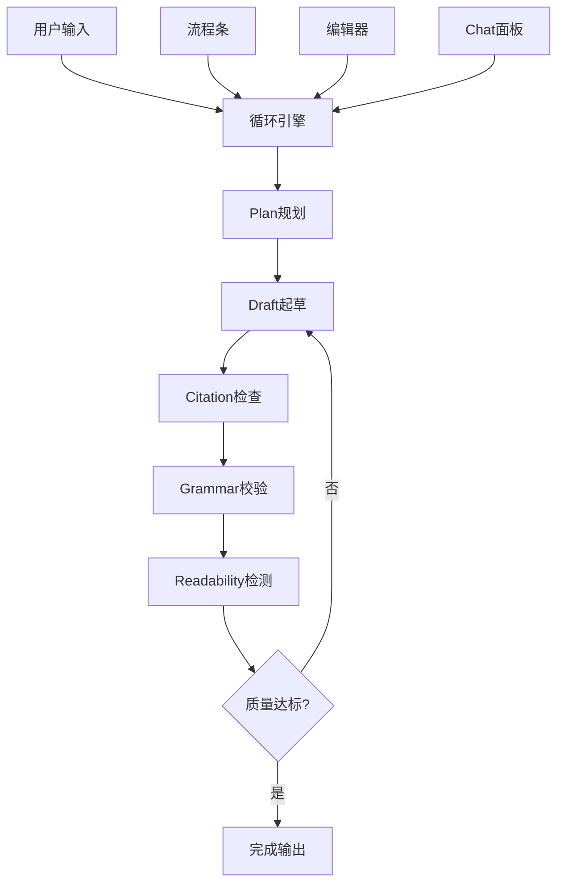

# AI Writing Tool - 完整产品需求文档 (PRD v1.0)

> 合并PRDv2.md与UIstyle.md，补充技术实现细节

## 📖 目录
1. [产品愿景](#1-产品愿景)
2. [目标用户](#2-目标用户)
3. [核心需求](#3-核心需求)
4. [功能架构](#4-功能架构)
5. [循环引擎详述](#5-循环引擎详述)
6. [用户界面规范](#6-用户界面规范)
7. [技术架构](#7-技术架构)
8. [实现路线图](#8-实现路线图)

---

## 1. 产品愿景

**打造一款「一条指令即可持续生成与自我审校」的 AI 写作工具**

### 1.1 核心价值主张
- **最少手动操作**: 一次性启动后自动完成写作全流程
- **质量保障**: 循环自检直到达到可读性≥70的标准
- **透明可控**: 完整版本树，每一步可视化和可回滚
- **专业引用**: 实时校验引用真伪，支持多种格式

### 1.2 产品定位
- **类型**: 个人向 AI 长文创作工作台
- **平台**: PWA 首发，Desktop优先
- **场景**: 2000字+长文，学术与创作双模式

---

## 2. 目标用户

### 2.1 用户画像

| 用户类型 | 典型场景 | 痛点 | 解决方案 |
|---------|----------|------|----------|
| 知识型博主 | 日更博客/专栏 | 构思耗时，排版繁琐，资料搜索分心 | 一键生成+自动校验 |
| 研究生/学者 | 撰写综述、论文草稿 | 引用格式复杂，修改轮次多，查重压力 | 引用校验+版本管理 |
| 产品经理 | 写PRD、需求文档 | 结构化输出&快速迭代 | 流程模板+批量修改 |

### 2.2 用户旅程

1. **Landing**: 选择空白/模板 → 输入主题或点Prompt建议
2. **Draft Seed**: AI生成大纲&段落骨架；流程条出现Plan&Draft节点
3. **循环写作**: 自动自检循环；用户可随时插入Prompt或手动编辑
4. **Review Mode**: 顶部切换；气泡标记错误；一键修复
5. **Export/Publish**: 选择格式或同步到集成(Notion、ArXiv)

---

## 3. 核心需求

### 3.1 功能需求优先级

| 优先级 | 功能 | 描述 | MVP |
|-------|------|------|-----|
| P0 | 循环生成引擎 | Plan→Draft→Citation→Grammar→Readability | ✅ |
| P0 | 流程条2.0 | 节点可视化、回滚、状态管理 | ✅ |
| P0 | 富文本编辑器 | 灰层预览、选区工具条 | ✅ |
| P1 | 引用校验 | DOI/PMID验证、格式化 | ✅ |
| P1 | 可读性检测 | Flesch-Kincaid≥70阈值 | ✅ |
| P2 | PWA离线 | Service Worker缓存 | ❌ |
| P2 | 插件系统 | 第三方扩展 | ❌ |

### 3.2 非功能需求

| 维度 | 需求 | 指标 |
|------|------|------|
| 性能 | 交互延迟 | ≤150ms |
| 性能 | 生成首字 | ≤3s |
| 缓存 | Redis命中率 | ≥95% |
| 质量 | 可读性通过率 | ≥95% |
| 时效 | 2000字完稿时间 | ≤30min |

---

## 4. 功能架构

### 4.1 核心模块



### 4.2 数据模型

```typescript
// 核心数据结构
interface Document {
  id: string
  title: string
  content: string
  status: WorkflowStatus
  nodes: WorkflowNode[]
  metadata: DocumentMetadata
}

interface WorkflowNode {
  id: string
  type: "Plan" | "Draft" | "Citation" | "Grammar" | "Readability" | "UserEdit"
  status: "pending" | "running" | "pass" | "fail"
  content?: string
  metrics?: NodeMetrics
  timestamp: Date
  branch?: string
}

interface NodeMetrics {
  readabilityScore?: number
  grammarErrors?: number
  citationCount?: number
  tokenUsage?: number
  processingTime?: number
}
```

---

## 5. 循环引擎详述

### 5.1 工作流状态机

```typescript
enum WorkflowStatus {
  IDLE = "idle",
  PLANNING = "planning", 
  DRAFTING = "drafting",
  CITATION_CHECK = "citation_check",
  GRAMMAR_CHECK = "grammar_check", 
  READABILITY_CHECK = "readability_check",
  DONE = "done",
  FAILED = "failed"
}
```

### 5.2 循环逻辑

1. **Plan阶段**: 
   - 分析用户需求生成大纲
   - 设定文章结构和目标字数
   - 生成各段落主题句

2. **Draft阶段**:
   - 基于大纲逐段生成内容
   - 保持逻辑连贯性
   - 达到目标字数要求

3. **Citation检查**:
   - 识别需要引用的观点
   - 调用CrossRef/PubMed API验证
   - 插入标准格式引用

4. **Grammar校验**:
   - 语法错误检测和修复
   - 句式优化建议
   - 术语一致性检查

5. **Readability检测**:
   - Flesch-Kincaid公式计算
   - 目标≥70分
   - 未达标自动回到Draft重写

### 5.3 失败回退策略

```typescript
// 回退配置
const RETRY_CONFIG = {
  maxRetries: 3,
  timeout: 60000, // 60s
  backoffStrategy: "exponential"
}

// 回退逻辑
if (node.status === "fail") {
  if (node.retryCount < RETRY_CONFIG.maxRetries) {
    // 自动回退到Draft重试
    workflow.rollbackTo("drafting")
  } else {
    // 请求用户干预
    workflow.requestUserIntervention()
  }
}
```

---

## 6. 用户界面规范

### 6.1 布局架构 (Holy Grail)

```
┌────────────────────────────────────────────────────────┐
│ TopBar (56px) - Logo | Title | Run/History/Export      │
├────────────────────────────────────────────────────────┤
│ ProcessBar (48px, sticky) - 节点流程可视化               │
├─────────────────────────────────┬──────────────────────┤
│                                │ ChatPanel (24%)     │
│ MainEditor (66%)               │ ├─ Tabs: Prompt/Log │
│ ├─ 富文本编辑区                   │ ├─ 消息列表          │
│ ├─ 灰层预览                      │ └─ 输入框+建议       │
│ └─ 浮动工具条                     │                     │
└─────────────────────────────────┴──────────────────────┘
```

### 6.2 组件规范

#### TopBar组件
```typescript
interface TopBarProps {
  title: string
  isAutoRunning: boolean
  onTitleChange: (title: string) => void
  onToggleAutoRun: () => void
  onOpenHistory: () => void
  onExport: () => void
}
```

#### ProcessBar组件
```typescript
interface ProcessBarProps {
  nodes: WorkflowNode[]
  currentNode?: string
  onNodeClick: (nodeId: string) => void
  onNodeRollback: (nodeId: string) => void
}
```

#### MainEditor组件
```typescript
interface MainEditorProps {
  content: string
  previewContent?: string
  isPreviewMode: boolean
  selectedText?: string
  onContentChange: (content: string) => void
  onTextSelect: (text: string, range: Range) => void
  onConfirmPreview: () => void
  onRejectPreview: () => void
}
```

### 6.3 响应式设计

| 屏幕尺寸 | 布局策略 | Chat面板 | 工具条 |
|---------|----------|----------|--------|
| Desktop ≥768px | 三栏布局 | 固定右侧 | 浮动覆盖 |
| Tablet 560-767px | 正文+折叠Chat | 抽屉式 | Icon模式 |
| Mobile <560px | 全屏正文 | FAB圆钮 | 纵向排列 |

### 6.4 动效规范

| 交互场景 | 动效类型 | 参数 |
|---------|----------|------|
| 节点状态变化 | scaleY + 颜色过渡 | 200ms ease-out |
| 内容写入 | 淡入 + 背景闪烁 | 600ms #fdf7e3 |
| 工具条显示 | scale弹入 | 0.9→1.0, 150ms |
| 灰层预览 | 覆盖渐现 | opacity 0→0.8 |

---

## 7. 技术架构

### 7.1 前端架构

```typescript
// 技术栈选择
const FRONTEND_STACK = {
  framework: "Next.js 14 (App Router)",
  stateManagement: "Zustand + XState",
  communication: "tRPC",
  styling: "Tailwind CSS",
  textEditor: "TipTap",
  animation: "Framer Motion",
  offline: "Service Worker + IndexedDB"
}
```

### 7.2 后端架构

```typescript
// 后端技术栈
const BACKEND_STACK = {
  framework: "FastAPI",
  database: "PostgreSQL + Redis",
  queue: "Redis Queue",
  ai: "Anthropic Claude + Local Models",
  cache: "Redis LRU (256MB)",
  search: "Elasticsearch (可选)",
  deployment: "Docker + K8s"
}
```

### 7.3 核心API设计

```typescript
// 循环引擎API
interface LoopEngineAPI {
  // 启动循环
  POST /api/loop/start
  body: { documentId: string, config: LoopConfig }
  
  // 获取状态
  GET /api/loop/{documentId}/status
  
  // 手动干预
  POST /api/loop/{documentId}/intervene
  body: { action: "retry" | "skip" | "rollback", nodeId?: string }
  
  // 停止循环
  POST /api/loop/{documentId}/stop
}

// 节点管理API
interface NodeAPI {
  // 获取节点详情
  GET /api/nodes/{nodeId}
  
  // 回滚到指定节点
  POST /api/nodes/{nodeId}/rollback
  
  // 获取节点历史
  GET /api/nodes/{documentId}/history
}

// 引用校验API
interface CitationAPI {
  // 验证DOI
  POST /api/citations/validate
  body: { doi: string }
  
  // 格式化引用
  POST /api/citations/format  
  body: { citation: Citation, style: "GB/T" | "APA" | "MLA" }
  
  // 批量校验
  POST /api/citations/batch-validate
  body: { citations: Citation[] }
}
```

### 7.4 缓存策略

```typescript
// Redis缓存配置
const CACHE_CONFIG = {
  citationCache: {
    keyPattern: "cite:{doi|pmid}",
    ttl: 7 * 24 * 3600, // 7天
    maxSize: "128MB"
  },
  documentCache: {
    keyPattern: "doc:{id}:version:{version}",
    ttl: 24 * 3600, // 1天
    maxSize: "64MB"
  },
  metricsCache: {
    keyPattern: "metrics:{type}:{date}",
    ttl: 3600, // 1小时
    maxSize: "32MB"
  }
}
```

---

## 8. 实现路线图

### 8.1 里程碑规划

| 里程碑 | 目标 | 功能范围 | 时间 |
|-------|------|----------|------|
| **M0 架构重构** | 建立新技术栈 | Next.js+FastAPI+Redis基础架构 | 2周 |
| **M1 循环引擎** | 核心流程MVP | Plan→Draft→Grammar→Readability | 3周 |
| **M2 UI重构** | 新界面实现 | Holy Grail布局+流程条+编辑器 | 3周 |
| **M3 引用系统** | 学术功能 | DOI校验+格式化+缓存 | 2周 |
| **M4 优化完善** | 性能调优 | PWA+离线+监控 | 2周 |

### 8.2 详细任务分解

#### M0: 架构重构 (2周)
- [ ] 环境搭建: Next.js + FastAPI新项目
- [ ] 数据库设计: 新的schema适配工作流
- [ ] Redis集成: 缓存层和队列系统
- [ ] 基础API: 文档CRUD + 状态管理
- [ ] 前端路由: App Router + 状态管理

#### M1: 循环引擎 (3周)
- [ ] 状态机实现: XState工作流定义
- [ ] 后端引擎: 异步任务队列处理
- [ ] AI集成: Claude API + 本地模型
- [ ] 质量检测: 语法检查 + 可读性算法
- [ ] 回退机制: 失败重试 + 用户干预

#### M2: UI重构 (3周)
- [ ] 布局框架: Holy Grail响应式布局
- [ ] ProcessBar: 节点可视化组件
- [ ] MainEditor: TipTap富文本编辑器
- [ ] ChatPanel: 实时交互面板
- [ ] FloatingToolbar: 上下文工具条

#### M3: 引用系统 (2周)
- [ ] DOI验证: CrossRef API集成
- [ ] 格式化引擎: 多格式引用生成
- [ ] 缓存优化: Redis LRU策略
- [ ] 批量处理: 异步校验队列
- [ ] 错误处理: 失效引用标记

#### M4: 优化完善 (2周)
- [ ] PWA配置: Service Worker + Manifest
- [ ] 离线缓存: IndexedDB + 同步策略
- [ ] 性能监控: 指标收集 + 告警
- [ ] 用户测试: Beta版本发布
- [ ] 文档完善: 用户手册 + API文档

### 8.3 风险评估与缓解

| 风险 | 概率 | 影响 | 缓解策略 |
|------|------|------|----------|
| API费用超支 | 高 | 高 | Token预估+限流+分层调用 |
| 循环死锁 | 中 | 高 | 超时机制+迭代上限+Watchdog |
| 引用准确率 | 中 | 中 | 双模型验证+人工校对提示 |
| 性能瓶颈 | 中 | 中 | 缓存优化+异步处理+负载均衡 |
| 用户体验 | 低 | 高 | 快速原型+用户测试+迭代优化 |

---

## 9. 成功指标

### 9.1 产品KPI

| 指标类型 | 具体指标 | 目标值 | 测量方法 |
|---------|----------|--------|----------|
| 效率 | 2000字完稿时间 | ≤30min | 用户行为统计 |
| 质量 | 可读性通过率 | ≥95% | 自动检测统计 |
| 留存 | 次日留存率 | ≥40% | 用户分析 |
| 满意度 | NPS评分 | ≥50 | 用户调研 |

### 9.2 技术指标

| 指标类型 | 具体指标 | 目标值 | 监控方法 |
|---------|----------|--------|----------|
| 性能 | API响应时间 | ≤150ms | APM监控 |
| 稳定性 | 系统可用性 | ≥99.9% | 健康检查 |
| 缓存 | Redis命中率 | ≥95% | Redis监控 |
| 成本 | AI API成本 | <$0.1/千字 | 成本统计 |

---

## 附录

### A. 技术选型对比

| 维度 | 当前方案 | 新方案 | 选择理由 |
|------|----------|--------|----------|
| 前端框架 | React + Vite | Next.js 14 | SSR+PWA+更好的SEO |
| 状态管理 | Context | Zustand+XState | 更好的状态机支持 |
| 文本编辑 | 无 | TipTap | 丰富的编辑功能 |
| 缓存层 | 无 | Redis | 高性能引用缓存 |
| 部署方式 | 分离部署 | 单体PWA | 更好的用户体验 |

### B. 数据迁移方案

```sql
-- 现有数据到新schema的迁移脚本
-- 1. 文档数据迁移
INSERT INTO new_documents (id, title, content, created_at)
SELECT id, title, content, created_at FROM old_documents;

-- 2. 用户数据迁移  
INSERT INTO new_users (id, username, email, created_at)
SELECT id, username, email, created_at FROM old_users;

-- 3. 创建默认工作流节点
INSERT INTO workflow_nodes (document_id, type, status, content)
SELECT id, 'UserEdit', 'pass', content FROM new_documents;
```

### C. 开发环境配置

```bash
# 前端开发环境
cd frontend
npm install
npm run dev

# 后端开发环境  
cd backend
python -m venv venv
source venv/bin/activate
pip install -r requirements.txt
uvicorn main:app --reload

# Redis启动
redis-server --maxmemory 256mb --maxmemory-policy allkeys-lru
```

---

**文档版本**: v1.0  
**最后更新**: 2025-07-10  
**负责人**: 产品团队  
**审核状态**: 待审核