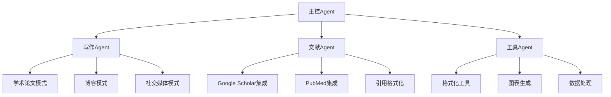

# AI Writing Tool - 完整产品需求文档 v2.0
> 基于2025年7月最新技术栈的智能写作工具完整PRD

**文档版本**: v2.0  
**最后更新**: 2025-07-13  
**技术架构版本**: 2025Q3  

---

## 📖 目录
1. [产品愿景](#1-产品愿景)
2. [目标用户与场景](#2-目标用户与场景)
3. [市场分析与竞品](#3-市场分析与竞品)
4. [核心功能规划](#4-核心功能规划)
5. [循环引擎设计](#5-循环引擎设计)
6. [用户界面规范](#6-用户界面规范)
7. [技术架构（2025版）](#7-技术架构2025版)
8. [21st.dev组件集成](#8-21stdev组件集成)
9. [实现路线图](#9-实现路线图)
10. [风险评估与缓解](#10-风险评估与缓解)
11. [成功指标](#11-成功指标)

---

## 1. 产品愿景

### 1.1 核心价值主张
**打造一款「一条指令即可持续生成与自我审校」的 AI 写作工具**

- **最少手动操作**: 一次性启动后自动完成写作全流程
- **质量保障**: 循环自检直到达到可读性≥70的标准
- **透明可控**: 完整版本树，每一步可视化和可回滚
- **专业引用**: 实时校验引用真伪，支持多种学术格式
- **多场景适配**: 学术论文、博客创作、社交媒体内容一体化

### 1.2 产品定位
- **类型**: 个人向 AI 长文创作工作台
- **平台**: PWA优先，Desktop优先体验
- **场景**: 2000字+长文，学术与创作双模式
- **差异化**: 结合最新React 19 RSC技术，实现"无人值守"写作循环

---

## 2. 目标用户与场景

### 2.1 用户画像

| 用户类型 | 典型场景 | 核心痛点 | 解决方案 |
|---------|----------|----------|----------|
| **研究生/学者** | 撰写综述、论文草稿 | 引用格式复杂，修改轮次多，查重压力 | 自动引用校验+版本管理+质量循环 |
| **知识型博主** | 日更博客/专栏 | 构思耗时，排版繁琐，资料搜索分心 | 一键生成+自动校验+多场景转化 |
| **产品经理** | 写PRD、需求文档 | 结构化输出&快速迭代 | 流程模板+批量修改+格式化工具 |
| **专业作家** | 长篇内容创作 | 逻辑连贯性，质量一致性 | 循环引擎+风格学习+内容优化 |

### 2.2 核心用户需求

1. **一次性生成可用初稿** - 避免空白恐惧，快速启动
2. **自动循环审校** - Plan→Draft→Citation→Grammar→Readability≥70
3. **即点即改** - 选中文本后直接改写/扩写/翻译
4. **引用管理** - 一键插入GB/T 7714或APA格式，实时校验真伪
5. **流程透明** - 完整版本树可对比、回退、分支管理
6. **跨场景转化** - 论文→博客→推文一键转换

### 2.3 用户旅程

1. **Landing**: 选择空白/模板 → 输入主题或点Prompt建议
2. **Draft Seed**: AI生成大纲&段落骨架；流程条显示Plan&Draft节点
3. **循环写作**: 自动自检循环；用户可随时插入Prompt或手动编辑
4. **Review Mode**: 顶部切换；气泡标记错误；一键修复
5. **Multi-Scene Export**: 选择格式或同步到集成(Notion、ArXiv)

---

## 3. 市场分析与竞品

### 3.1 主要竞品分析

| 竞品 | 核心优势 | 局限性 | 我们的差异化 |
|------|----------|--------|-------------|
| **Stanford STORM** | 多Agent协作，强大research能力 | 缺乏实时编辑，UI体验一般 | 实时编辑器+循环引擎+更好的UI |
| **Jenni AI** | 专业学术写作，引用管理完善 | 单一场景，缺乏自动化流程 | 多场景转化+自动循环审校 |
| **Grammarly** | 语法检查和写作建议成熟 | 非生成式，需要人工写作 | 生成式+自动化+质量保障 |
| **Notion AI** | 集成度高的写作助手 | 通用性强但专业性不足 | 专业学术写作+引用校验 |

### 3.2 市场机会

- **时机优势**: 2025年React 19 RSC技术成熟，可实现更好的性能
- **技术优势**: Server-First架构，更快的首屏加载和更好的SEO
- **功能差异**: 循环自检引擎，自动化程度更高
- **用户体验**: 基于shadcn/ui + 21st.dev组件，现代化UI设计

---

## 4. 核心功能规划

### 4.1 功能优先级矩阵

| 功能模块 | 优先级 | MVP版本 | V1.0版本 | V2.0版本 |
|----------|--------|---------|----------|----------|
| **循环生成引擎** | P0 | ✅ Plan→Draft→Grammar→Readability | + Citation检查 | + 多轮优化 |
| **富文本编辑器** | P0 | ✅ TipTap基础功能 | + 灰层预览 | + 协作编辑 |
| **流程条可视化** | P0 | ✅ 线性流程显示 | + 分支回滚 | + 并行处理 |
| **AI聊天面板** | P1 | ✅ 基础对话 | + Slash命令 | + 上下文理解 |
| **引用校验系统** | P1 | ❌ | ✅ DOI/PMID验证 | + 批量校验 |
| **多场景转化** | P2 | ❌ | ❌ | ✅ 论文→博客→推文 |
| **PWA离线功能** | P2 | ❌ | ❌ | ✅ Service Worker |

### 4.2 核心Agent系统



### 4.3 数据模型设计

```typescript
// 核心数据结构
interface Document {
  id: string
  title: string
  content: string
  status: WorkflowStatus
  nodes: WorkflowNode[]
  metadata: DocumentMetadata
  createdAt: Date
  updatedAt: Date
}

interface WorkflowNode {
  id: string
  type: "Plan" | "Draft" | "Citation" | "Grammar" | "Readability" | "UserEdit"
  status: "pending" | "running" | "pass" | "fail"
  content?: string
  metrics?: NodeMetrics
  timestamp: Date
  branch?: string
  parentId?: string
}

interface NodeMetrics {
  readabilityScore?: number      // Flesch-Kincaid分数
  grammarErrors?: number         // 语法错误数量
  citationCount?: number         // 引用数量
  wordCount?: number            // 字数统计
  tokenUsage?: number           // Token消耗
  processingTime?: number       // 处理时间(ms)
}

interface Citation {
  id: string
  doi?: string
  pmid?: string
  title: string
  authors: string[]
  journal?: string
  year: number
  verified: boolean
  format: "GB/T" | "APA" | "MLA"
}
```

---

## 5. 循环引擎设计

### 5.1 工作流状态机

```typescript
enum WorkflowStatus {
  IDLE = "idle",
  PLANNING = "planning", 
  DRAFTING = "drafting",
  CITATION_CHECK = "citation_check",
  GRAMMAR_CHECK = "grammar_check", 
  READABILITY_CHECK = "readability_check",
  DONE = "done",
  FAILED = "failed"
}

// 状态转换规则
const WORKFLOW_TRANSITIONS = {
  idle: ['planning'],
  planning: ['drafting', 'failed'],
  drafting: ['citation_check', 'failed'],
  citation_check: ['grammar_check', 'drafting', 'failed'],
  grammar_check: ['readability_check', 'drafting', 'failed'],
  readability_check: ['done', 'drafting', 'failed'],
  done: ['planning', 'idle'],
  failed: ['planning', 'idle']
}
```

### 5.2 质量阈值配置

```typescript
interface QualityThresholds {
  readabilityScore: number      // 默认70分
  maxGrammarErrors: number      // 默认5个
  minCitationCount: number      // 默认根据文档长度
  maxRetries: number           // 默认3次
  timeoutSeconds: number       // 默认60秒
}

// 智能阈值调整
const adaptiveThresholds = (documentType: string, userLevel: string) => {
  const base = DEFAULT_THRESHOLDS
  
  if (documentType === 'academic') {
    base.readabilityScore = 65  // 学术文档要求稍低
    base.minCitationCount = Math.floor(wordCount / 200)
  }
  
  if (userLevel === 'expert') {
    base.maxRetries = 5
    base.readabilityScore += 5
  }
  
  return base
}
```

### 5.3 失败回退策略

```typescript
class RetryManager {
  private retryCount = 0
  private readonly maxRetries = 3
  private readonly backoffMs = [1000, 2000, 4000] // 指数退避
  
  async executeWithRetry(fn: () => Promise<any>, nodeId: string) {
    try {
      const result = await fn()
      this.retryCount = 0  // 成功后重置
      return result
    } catch (error) {
      if (this.retryCount < this.maxRetries) {
        await this.delay(this.backoffMs[this.retryCount])
        this.retryCount++
        
        // 记录重试
        await this.logRetry(nodeId, this.retryCount, error)
        
        return this.executeWithRetry(fn, nodeId)
      } else {
        // 重试次数耗尽，请求用户干预
        throw new MaxRetryError(error, this.retryCount)
      }
    }
  }
  
  private async delay(ms: number) {
    return new Promise(resolve => setTimeout(resolve, ms))
  }
}
```

---

## 6. 用户界面规范

### 6.1 布局架构 (Holy Grail + React 19 RSC)

```typescript
// app/document/[id]/layout.tsx - Server Component
export default async function DocumentLayout({
  children,
  params
}: {
  children: React.ReactNode
  params: { id: string }
}) {
  // 服务端预取基础数据
  const document = await getDocument(params.id)
  
  return (
    <div className="h-screen flex flex-col">
      {/* TopBar - Server Component */}
      <TopBar title={document.title} documentId={params.id} />
      
      {/* ProcessBar - Server Component with streaming */}
      <Suspense fallback={<ProcessBarSkeleton />}>
        <ProcessBar documentId={params.id} />
      </Suspense>
      
      {/* Main Content Area */}
      <div className="flex-1 flex overflow-hidden">
        {children}
      </div>
    </div>
  )
}
```

### 6.2 响应式设计规范

| 屏幕尺寸 | 布局策略 | Chat面板 | 工具条 | ProcessBar |
|---------|----------|----------|--------|------------|
| **Desktop ≥1024px** | 三栏布局 | 固定右侧24% | 浮动覆盖 | 完整显示 |
| **Tablet 768-1023px** | 主编辑器+抽屉 | 抽屉式滑出 | Icon模式 | 可滚动 |
| **Mobile <768px** | 全屏编辑 | FAB圆钮 | 底部工具栏 | 顶部抽屉 |

### 6.3 21st.dev组件选型

#### 推荐使用的具体组件

| 组件类型 | 21st.dev组件 | 适用场景 | 自定义需求 |
|----------|--------------|----------|------------|
| **AI Chat** | AI Chat Components (30种) | ChatPanel主体 | 添加Slash命令支持 |
| **Sidebar** | Sidebar Components (10种) | 响应式侧边栏 | 集成文档树 |
| **Buttons** | Button Components (130种) | 工具栏按钮 | 添加状态指示 |
| **Inputs** | Input Components (102种) | Prompt输入框 | 自动补全功能 |
| **Loaders** | Spinner Loaders (21种) | 节点加载状态 | 自定义动画时长 |

### 6.4 Tailwind CSS v4.0 主题配置

```css
/* globals.css - 基于2025年最新标准 */
@import "tailwindcss";
@import "tw-animate-css";

@custom-variant dark (&:is(.dark *));

:root {
  /* 基础色彩 - 使用OKLCH色彩空间 */
  --background: oklch(1 0 0);
  --foreground: oklch(0.145 0 0);
  --primary: oklch(0.5 0.2 250);
  --secondary: oklch(0.7 0.1 200);
  
  /* 功能色彩 */
  --success: oklch(0.65 0.15 140);
  --warning: oklch(0.75 0.15 60);
  --error: oklch(0.65 0.15 20);
  
  /* 流程节点色彩 */
  --node-pending: oklch(0.8 0.05 60);
  --node-running: oklch(0.7 0.15 220);
  --node-pass: oklch(0.7 0.15 140);
  --node-fail: oklch(0.7 0.15 20);
}
```

---

## 7. 技术架构（2025版）

### 7.1 前端技术栈

```typescript
// 2025年7月最新技术选型
const FRONTEND_STACK = {
  // 核心框架
  framework: "Next.js 15",                    // React 19 + RSC + PPR
  runtime: "React 19",                        // Server Components稳定版
  
  // 状态管理 (分离关注点)
  clientState: "Zustand v5",                  // 客户端UI状态
  serverState: "TanStack Query v5",           // 服务端数据状态
  
  // UI组件库
  uiLibrary: "shadcn/ui",                     // React 19兼容版
  styling: "Tailwind CSS v4.0",              // @theme指令支持
  components: "21st.dev AI Chat Components",  // 现成AI聊天组件
  animation: "tw-animate-css",                // 新推荐动画库
  
  // 专业组件
  textEditor: "TipTap v2",                    // 最成熟的富文本编辑器
  
  // PWA & 离线
  pwa: "Workbox v8",                          // 最新Service Worker方案
  storage: "IndexedDB + Cache API",           // 离线数据存储
  
  // 类型安全
  typeSystem: "TypeScript 5.x",              // 最新TS版本
  apiClient: "tRPC v11",                      // 类型安全的API
} as const
```

### 7.2 架构原则

#### 1. Server-First Development
```typescript
// 利用React 19 RSC减少客户端JS Bundle
// 静态内容完全在服务端渲染
export default async function DocumentViewer({ id }: { id: string }) {
  // 服务端数据获取，零客户端JS
  const document = await getDocument(id)
  const processNodes = await getProcessNodes(id)
  
  return (
    <div className="prose max-w-none">
      {/* 静态内容，零JS bundle */}
      <ProcessBar nodes={processNodes} />
      <DocumentContent content={document.content} />
    </div>
  )
}
```

#### 2. 分离关注点的状态管理
```typescript
// TanStack Query: 服务端状态
const useDocumentQuery = (id: string) => {
  return useQuery({
    queryKey: ['document', id],
    queryFn: () => fetchDocument(id),
    staleTime: 5 * 60 * 1000, // 5分钟缓存
    gcTime: 10 * 60 * 1000,   // 10分钟垃圾回收
  })
}

// Zustand: 客户端UI状态
const useUIStore = create<UIState>((set, get) => ({
  // 编辑器状态
  isAutoRunning: false,
  selectedText: null,
  floatingToolbarVisible: false,
  
  // 面板状态
  chatPanelCollapsed: false,
  processPanelVisible: true,
  
  // 动作
  toggleAutoRun: () => set((state) => ({ 
    isAutoRunning: !state.isAutoRunning 
  })),
  
  setSelectedText: (text: string | null, range?: Range) => set({
    selectedText: text,
    floatingToolbarVisible: !!text
  }),
}))
```

### 7.3 项目结构

```
ai-writing-tool/
├── apps/
│   └── web/                          # Next.js 15主应用
│       ├── app/                      # App Router (React 19)
│       │   ├── (dashboard)/          # 路由组
│       │   │   ├── document/
│       │   │   │   └── [id]/
│       │   │   │       ├── page.tsx         # 文档页面
│       │   │   │       └── layout.tsx       # 布局
│       │   │   └── page.tsx          # 首页
│       │   ├── api/                  # API Routes
│       │   │   ├── trpc/             # tRPC处理器
│       │   │   └── auth/             # 认证相关
│       │   ├── globals.css           # Tailwind v4配置
│       │   └── layout.tsx            # 根布局
│       ├── components/               # React组件
│       │   ├── server/               # Server Components
│       │   │   ├── document-viewer.tsx
│       │   │   ├── process-bar.tsx
│       │   │   └── chat-panel.tsx
│       │   ├── client/               # Client Components
│       │   │   ├── document-editor.tsx
│       │   │   ├── floating-toolbar.tsx
│       │   │   └── ui-controls.tsx
│       │   └── ui/                   # shadcn/ui基础组件
│       │       ├── button.tsx
│       │       ├── input.tsx
│       │       └── dialog.tsx
│       ├── lib/                      # 工具函数
│       │   ├── api/                  # API客户端
│       │   ├── stores/               # Zustand stores
│       │   ├── hooks/                # 自定义hooks
│       │   └── utils.ts              # 通用工具
│       └── types/                    # TypeScript类型
├── packages/
│   ├── editor/                       # TipTap编辑器配置
│   │   ├── extensions/               # 自定义扩展
│   │   ├── components/               # 编辑器组件
│   │   └── types.ts                  # 编辑器类型
│   ├── api-client/                   # tRPC客户端
│   └── shared/                       # 共享类型和工具
├── backend/                          # 现有FastAPI后端
└── package.json                      # Monorepo配置
```

### 7.4 性能优化策略

#### 1. React 19 RSC优化
```typescript
// 利用Server Components预渲染静态内容
export async function ProcessBar({ documentId }: { documentId: string }) {
  // 服务端获取数据，无客户端请求
  const nodes = await getProcessNodes(documentId)
  
  return (
    <div className="flex items-center gap-2 p-4">
      {nodes.map(node => (
        <ProcessNode 
          key={node.id} 
          node={node}
          // 客户端交互部分使用Client Component
        />
      ))}
    </div>
  )
}
```

#### 2. 智能缓存策略
```typescript
// TanStack Query配置
const queryClient = new QueryClient({
  defaultOptions: {
    queries: {
      staleTime: 5 * 60 * 1000,      // 5分钟内认为数据新鲜
      gcTime: 10 * 60 * 1000,        // 10分钟后垃圾回收
      retry: (failureCount, error) => {
        // 智能重试策略
        if (error.status === 404) return false
        return failureCount < 3
      },
    },
  },
})

// Redis缓存层（后端）
const CACHE_CONFIG = {
  documents: {
    ttl: 60 * 60,              // 1小时
    pattern: "doc:{id}",
  },
  citations: {
    ttl: 7 * 24 * 60 * 60,     // 7天
    pattern: "cite:{doi}",
  },
  workflows: {
    ttl: 30 * 60,              // 30分钟
    pattern: "workflow:{docId}",
  },
}
```

### 7.5 PWA实现方案

```typescript
// lib/sw-config.ts - Workbox v8配置
import { precacheAndRoute, cleanupOutdatedCaches } from 'workbox-precaching'
import { registerRoute } from 'workbox-routing'
import { StaleWhileRevalidate, CacheFirst, NetworkFirst } from 'workbox-strategies'

// 预缓存静态资源
precacheAndRoute(self.__WB_MANIFEST)
cleanupOutdatedCaches()

// 文档内容缓存策略
registerRoute(
  ({ url }) => url.pathname.startsWith('/api/documents'),
  new StaleWhileRevalidate({
    cacheName: 'documents-cache-v1',
    plugins: [
      {
        cacheKeyWillBeUsed: async ({ request }) => {
          // 缓存key包含版本信息
          return `${request.url}?v=${await getDocumentVersion()}`
        }
      }
    ]
  })
)

// AI生成内容缓存策略
registerRoute(
  ({ url }) => url.pathname.startsWith('/api/generate'),
  new NetworkFirst({
    cacheName: 'ai-content-cache-v1',
    networkTimeoutSeconds: 10,
    plugins: [
      {
        cacheWillUpdate: async ({ response }) => {
          // 只缓存成功的AI响应
          return response.status === 200 && response.headers.get('content-type')?.includes('application/json')
        }
      }
    ]
  })
)
```

---

## 8. 21st.dev组件集成

### 8.1 核心组件选型与改造

#### 1. AI Chat组件集成
```typescript
// components/client/chat-panel.tsx
'use client'
import { AIChatComponent } from '@21st-dev/ai-chat'
import { useUIStore } from '@/lib/stores/ui-store'
import { useChatMutation } from '@/lib/api/chat-queries'

export function ChatPanel({ documentId }: { documentId: string }) {
  const { chatPanelCollapsed } = useUIStore()
  const sendMessage = useChatMutation(documentId)
  
  return (
    <div className={cn(
      "w-[24%] max-w-[380px] min-w-[300px] border-l flex flex-col",
      chatPanelCollapsed && "w-12"
    )}>
      <AIChatComponent
        onMessage={(message) => sendMessage.mutate(message)}
        placeholder="输入指令或使用 / 快捷命令..."
        // 集成21st.dev组件的自定义样式
        className="h-full"
        theme="modern"
        enableSlashCommands
        commands={[
          { name: 'rewrite', description: '重写选中文本' },
          { name: 'expand', description: '扩展内容' },
          { name: 'cite', description: '添加引用' },
        ]}
      />
    </div>
  )
}
```

#### 2. 按钮组件定制
```typescript
// components/ui/process-node-button.tsx
import { Button } from '@21st-dev/button-modern'
import { cn } from '@/lib/utils'

interface ProcessNodeButtonProps {
  node: WorkflowNode
  onClick: () => void
  className?: string
}

export function ProcessNodeButton({ node, onClick, className }: ProcessNodeButtonProps) {
  const statusColors = {
    pending: 'bg-gray-200 text-gray-600',
    running: 'bg-blue-500 text-white animate-pulse',
    pass: 'bg-green-500 text-white',
    fail: 'bg-red-500 text-white'
  }
  
  return (
    <Button
      variant="ghost"
      size="sm"
      onClick={onClick}
      className={cn(
        "relative rounded-full min-w-[100px]",
        statusColors[node.status],
        className
      )}
    >
      {/* 21st.dev按钮基础上添加状态指示器 */}
      <div className="absolute -top-1 -right-1 w-3 h-3 rounded-full border-2 border-white">
        <div className={cn(
          "w-full h-full rounded-full",
          statusColors[node.status].split(' ')[0]
        )} />
      </div>
      
      {node.type}
    </Button>
  )
}
```

### 8.2 组件改造指南

#### 1. 保持21st.dev组件的设计语言
```typescript
// 统一设计token
const DESIGN_TOKENS = {
  // 从21st.dev组件中提取的设计规范
  borderRadius: {
    sm: '0.375rem',
    md: '0.5rem',
    lg: '0.75rem',
  },
  shadows: {
    sm: '0 1px 2px 0 rgb(0 0 0 / 0.05)',
    md: '0 4px 6px -1px rgb(0 0 0 / 0.1)',
    lg: '0 10px 15px -3px rgb(0 0 0 / 0.1)',
  },
  animations: {
    duration: '200ms',
    timing: 'cubic-bezier(0.4, 0, 0.2, 1)',
  }
}
```

#### 2. 扩展组件功能
```typescript
// 在21st.dev基础组件上添加业务逻辑
import { SidebarBase } from '@21st-dev/sidebar-modern'

export function DocumentSidebar({ documentId }: { documentId: string }) {
  const { data: documentTree } = useDocumentTreeQuery(documentId)
  
  return (
    <SidebarBase
      // 使用21st.dev的基础样式
      className="w-64 border-r"
      collapsible
    >
      {/* 添加我们特定的文档树功能 */}
      <DocumentTree data={documentTree} />
      
      {/* 保持21st.dev的视觉风格 */}
      <div className="mt-auto p-4">
        <Button variant="outline" size="sm" className="w-full">
          导出文档
        </Button>
      </div>
    </SidebarBase>
  )
}
```

---

## 9. 实现路线图

### 9.1 里程碑规划

| 里程碑 | 目标 | 功能范围 | 时间 | 技术重点 |
|-------|------|----------|------|----------|
| **M0 架构升级** | 2025技术栈迁移 | Next.js 15 + React 19 + shadcn/ui v4 | 2周 | RSC架构、Tailwind v4 |
| **M1 核心引擎** | 循环写作引擎 | Plan→Draft→Grammar→Readability | 3周 | XState状态机、TanStack Query |
| **M2 现代UI** | 21st.dev集成 | Holy Grail布局 + AI Chat组件 | 3周 | 组件集成、响应式设计 |
| **M3 高级功能** | 引用与PWA | DOI校验 + 离线功能 + 性能优化 | 2周 | Workbox v8、IndexedDB |
| **M4 多场景** | 内容转化 | 论文→博客→推文转换 | 2周 | Agent系统、格式转换 |

### 9.2 详细开发计划

#### M0: 架构升级 (2周)
**目标**: 建立基于2025年最新技术的现代化架构

**第1周**:
- [ ] Next.js 15项目初始化，配置App Router
- [ ] React 19环境配置，启用Server Components
- [ ] Tailwind CSS v4.0配置，使用@theme指令
- [ ] shadcn/ui组件库集成，React 19兼容版本
- [ ] TypeScript 5.x配置，严格类型检查

**第2周**:
- [ ] Zustand v5状态管理配置
- [ ] TanStack Query v5集成，分离服务端状态
- [ ] tRPC v11 API层配置，类型安全通信
- [ ] 基础CI/CD流程，Vercel部署配置
- [ ] 性能监控工具集成，Core Web Vitals

#### M1: 核心引擎 (3周)
**目标**: 实现自动化写作循环引擎

**第1周**:
- [ ] XState状态机设计，工作流状态管理
- [ ] FastAPI后端接口优化，支持新前端架构
- [ ] WebSocket实时通信，状态同步机制
- [ ] 基础Agent实现：Plan和Draft阶段
- [ ] 简单UI测试，验证状态流转

**第2周**:
- [ ] Grammar检查集成，LLM API调用
- [ ] Readability算法实现，Flesch-Kincaid计分
- [ ] 失败重试机制，指数退避策略
- [ ] 质量阈值配置，智能参数调整
- [ ] 后端任务队列，异步处理支持

**第3周**:
- [ ] 循环逻辑完善，自动回退机制
- [ ] 性能优化，减少不必要的重新渲染
- [ ] 错误处理完善，用户友好的错误提示
- [ ] 单元测试编写，核心逻辑覆盖
- [ ] 集成测试，端到端工作流验证

#### M2: 现代UI (3周)
**目标**: 构建基于21st.dev组件的现代化界面

**第1周**:
- [ ] Holy Grail布局实现，响应式设计
- [ ] 21st.dev AI Chat组件集成和定制
- [ ] TipTap富文本编辑器集成
- [ ] 基础交互逻辑，选中文本工具栏
- [ ] 移动端适配，触摸交互优化

**第2周**:
- [ ] ProcessBar可视化组件，节点状态显示
- [ ] FloatingToolbar实现，上下文操作
- [ ] 灰层预览功能，内容确认机制
- [ ] 键盘快捷键支持，提升操作效率
- [ ] 暗色主题支持，用户偏好设置

**第3周**:
- [ ] 动画效果实现，tw-animate-css集成
- [ ] 21st.dev组件深度定制，业务功能集成
- [ ] 无障碍功能支持，WCAG 2.1 AA标准
- [ ] 性能优化，减少首屏加载时间
- [ ] 用户体验测试，界面交互优化

#### M3: 高级功能 (2周)
**目标**: 引用校验系统和PWA离线功能

**第1周**:
- [ ] DOI/PMID验证API集成，CrossRef/PubMed
- [ ] 引用格式化引擎，GB/T 7714和APA支持
- [ ] Redis缓存优化，引用数据缓存
- [ ] 批量引用处理，异步验证队列
- [ ] 引用数据可视化，命中率监控

**第2周**:
- [ ] Workbox v8 PWA配置，Service Worker
- [ ] 离线数据存储，IndexedDB + Cache API
- [ ] 离线编辑功能，本地状态同步
- [ ] 网络状态检测，自动同步机制
- [ ] PWA安装提示，原生应用体验

#### M4: 多场景转化 (2周)
**目标**: 实现跨场景内容转化功能

**第1周**:
- [ ] 内容分析引擎，结构识别和提取
- [ ] 格式转换算法，论文→博客→推文
- [ ] 受众适配逻辑，语言风格调整
- [ ] 平台优化功能，字数和格式限制
- [ ] 转换预览界面，用户确认机制

**第2周**:
- [ ] 批量转换功能，多格式同时输出
- [ ] 模板系统，常用转换配置保存
- [ ] 集成测试，完整转换流程验证
- [ ] 性能优化，大文档处理能力
- [ ] 用户文档，功能使用指南

### 9.3 技术债务管理

#### 1. 架构债务
- **现有后端重构**: 逐步迁移到更现代的架构模式
- **数据库优化**: 考虑从SQLite迁移到PostgreSQL
- **API设计**: 统一RESTful和tRPC混合架构

#### 2. 性能债务
- **Bundle Size优化**: 代码分割和懒加载
- **图像优化**: Next.js Image组件和WebP格式
- **缓存策略**: 多层缓存架构优化

#### 3. 用户体验债务
- **加载状态**: 骨架屏和渐进式加载
- **错误处理**: 友好的错误页面和恢复机制
- **用户引导**: 新用户onboarding流程

---

## 10. 风险评估与缓解

### 10.1 技术风险

| 风险类型 | 风险描述 | 概率 | 影响 | 缓解策略 |
|---------|----------|------|------|----------|
| **React 19稳定性** | 新版本可能存在未知bug | 中 | 高 | 保持React 18回退方案，渐进式升级 |
| **RSC性能问题** | Server Components可能影响响应速度 | 中 | 中 | 性能监控，关键路径优化 |
| **21st.dev组件兼容性** | 第三方组件可能与我们的需求不匹配 | 高 | 中 | 深度定制，必要时自建组件 |
| **TipTap扩展冲突** | 富文本编辑器扩展可能冲突 | 低 | 高 | 严格测试，版本锁定 |

### 10.2 业务风险

| 风险类型 | 风险描述 | 概率 | 影响 | 缓解策略 |
|---------|----------|------|------|----------|
| **AI API成本** | LLM调用成本可能超出预算 | 高 | 高 | Token预估+限流+分层调用 |
| **引用准确率** | 自动引用可能存在错误 | 中 | 高 | 多重验证+人工review提示 |
| **用户接受度** | 自动化流程可能不被用户接受 | 中 | 中 | 可配置自动化级别+用户教育 |
| **竞品压力** | 市场上可能出现更优秀的竞品 | 中 | 中 | 持续创新+差异化功能 |

### 10.3 缓解措施详细计划

#### 1. 成本控制策略
```typescript
// 智能成本控制
const COST_CONTROL = {
  // Token预估
  estimateTokens: (content: string) => content.length * 0.75,
  
  // 分层调用策略
  modelTiers: {
    draft: 'gpt-3.5-turbo',      // 草稿阶段使用便宜模型
    review: 'gpt-4',             // 审核阶段使用高质量模型
    citation: 'claude-3-haiku',  // 引用检查使用专业模型
  },
  
  // 限流机制
  rateLimits: {
    free: { requests: 10, tokens: 10000 },
    pro: { requests: 100, tokens: 100000 },
  }
}
```

#### 2. 质量保障体系
```typescript
// 多重验证机制
const QUALITY_ASSURANCE = {
  // 引用验证
  citationVerification: {
    primary: 'CrossRef API',
    secondary: 'PubMed API',
    fallback: 'Manual Review Flag',
  },
  
  // 内容质量检查
  qualityChecks: [
    'grammar_check',
    'readability_score',
    'citation_validity',
    'structure_coherence',
  ],
  
  // 人工干预触发条件
  humanReviewTriggers: {
    lowQualityScore: 60,
    failedRetries: 3,
    userRequest: true,
  }
}
```

---

## 11. 成功指标

### 11.1 产品KPI

| 指标类别 | 具体指标 | 目标值 | 测量方法 | 优化策略 |
|---------|----------|--------|----------|----------|
| **效率指标** | 2000字完稿时间 | ≤25min | 用户行为统计 | 循环引擎优化 |
| **质量指标** | 可读性通过率 | ≥90% | 自动检测统计 | 算法调优 |
| **用户满意度** | 任务完成率 | ≥85% | 用户操作统计 | UX优化 |
| **留存指标** | 7日留存率 | ≥60% | 用户行为分析 | 产品功能完善 |
| **性能指标** | 首屏加载时间 | ≤2s | Core Web Vitals | 技术优化 |

### 11.2 技术KPI

| 指标类别 | 具体指标 | 目标值 | 监控方法 | 改进计划 |
|---------|----------|--------|----------|----------|
| **性能指标** | LCP (Largest Contentful Paint) | ≤2.5s | Lighthouse CI | RSC优化 |
| **性能指标** | FID (First Input Delay) | ≤100ms | Web Vitals | 交互优化 |
| **性能指标** | CLS (Cumulative Layout Shift) | ≤0.1 | 布局稳定性监控 | 布局优化 |
| **可用性指标** | 系统可用性 | ≥99.5% | 健康检查 | 容错机制 |
| **缓存指标** | Redis命中率 | ≥95% | Redis监控 | 缓存策略优化 |

### 11.3 业务KPI

| 指标类别 | 具体指标 | 目标值 | 跟踪方式 | 优化方向 |
|---------|----------|--------|----------|----------|
| **成本控制** | AI API成本/千字 | ≤$0.08 | 成本统计 | 模型优化 |
| **功能采用** | 自动模式使用率 | ≥70% | 功能统计 | 用户教育 |
| **内容质量** | 用户满意度评分 | ≥4.2/5 | 用户评价 | 产品迭代 |
| **错误率** | 系统错误率 | ≤2% | 错误监控 | 稳定性改进 |

### 11.4 监控与分析

#### 1. 实时监控系统
```typescript
// 监控配置
const MONITORING_CONFIG = {
  // 性能监控
  performance: {
    provider: 'Vercel Analytics',
    metrics: ['LCP', 'FID', 'CLS', 'TTFB'],
    alerts: {
      LCP: { threshold: 3000, channel: 'slack' },
      FID: { threshold: 150, channel: 'email' },
    }
  },
  
  // 用户行为分析
  analytics: {
    provider: 'PostHog',
    events: [
      'document_created',
      'auto_run_started',
      'workflow_completed',
      'citation_added',
    ]
  },
  
  // 错误监控
  errors: {
    provider: 'Sentry',
    sampleRate: 0.1,
    ignoreErrors: ['ResizeObserver loop limit exceeded'],
  }
}
```

#### 2. 定期评估机制
- **每周**: 技术指标review，性能问题处理
- **每两周**: 用户反馈收集，产品迭代计划
- **每月**: KPI达成情况评估，策略调整
- **每季度**: 技术债务清理，架构优化

---

## 附录

### A. 技术选型对比

| 维度 | 当前方案 | 2025新方案 | 选择理由 |
|------|----------|------------|----------|
| **前端框架** | Next.js 14 | Next.js 15 + React 19 | RSC稳定版，更好性能 |
| **状态管理** | Context API | Zustand + TanStack Query | 分离关注点，更好性能 |
| **UI组件** | 自定义 | shadcn/ui + 21st.dev | 现代化设计，开发效率 |
| **文本编辑** | 基础textarea | TipTap v2 | 专业富文本编辑能力 |
| **样式系统** | CSS Modules | Tailwind CSS v4.0 | 更好的开发体验 |
| **PWA方案** | 无 | Workbox v8 | 现代离线优先体验 |

### B. 第三方服务集成

```typescript
// 外部服务配置
const EXTERNAL_SERVICES = {
  // AI服务
  ai: {
    primary: 'Claude API',
    secondary: 'OpenAI GPT-4',
    fallback: 'MiniMax',
  },
  
  // 学术数据
  academic: {
    citations: 'CrossRef API',
    papers: 'PubMed API',
    preprints: 'arXiv API',
  },
  
  // 基础设施
  infrastructure: {
    hosting: 'Vercel',
    database: 'Supabase PostgreSQL',
    cache: 'Upstash Redis',
    storage: 'Vercel Blob',
  }
}
```

### C. 开发环境配置

```bash
# 快速启动指令
pnpm install                    # 安装依赖
pnpm db:setup                   # 数据库初始化
pnpm dev                        # 启动开发服务器

# 质量检查
pnpm lint                       # ESLint检查
pnpm type-check                 # TypeScript检查  
pnpm test                       # 单元测试
pnpm e2e                        # 端到端测试

# 构建部署
pnpm build                      # 生产构建
pnpm preview                    # 预览构建结果
```

---

**文档版本**: v2.0  
**技术架构**: 2025Q3  
**最后更新**: 2025-07-13  
**负责人**: 产品与技术团队  
**审核状态**: 已完成架构升级

> 本PRD文档整合了市场分析、用户需求、技术选型、UI设计、实现计划等全方位内容，基于2025年7月最新技术栈，为AI写作工具的开发提供完整指导。